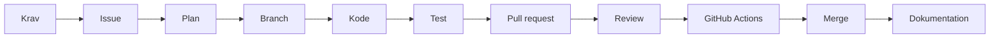
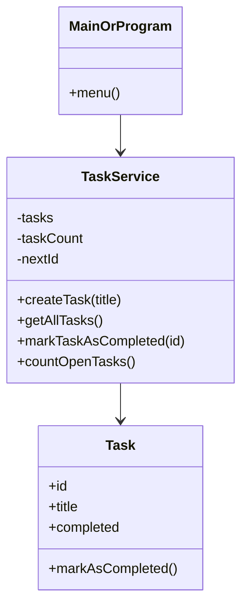
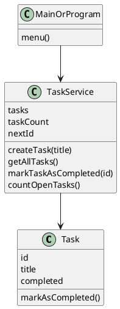
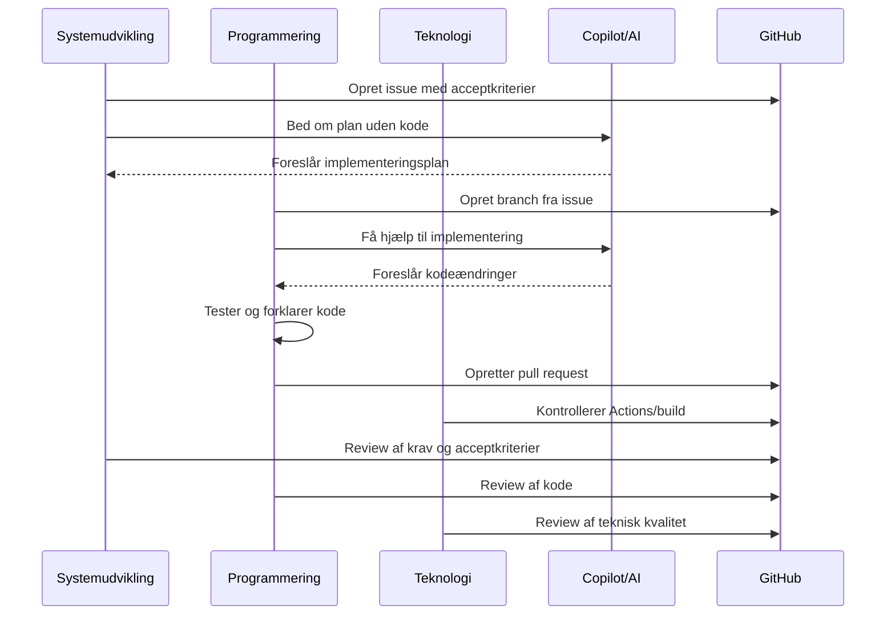

# GitHub Copilot workshop task-app

Hands-on workshop om GitHub Copilot, GitHub Projects, issues, branches, pull requests, review, GitHub Actions og agent-workflows.

Workshoppen kan gennemføres i både Java og .NET. Deltagerne vælger spor, men arbejder med samme case og samme GitHub-flow.

## Formål

Formålet er ikke kun at vise, at Copilot kan skrive kode.

Formålet er at afprøve, hvordan AI kan indgå i en samlet udviklingsproces:



Den centrale regel er:

> AI-genereret kode er først færdig, når den er forstået, testet, reviewet og koblet til et issue.

## Målgruppe

Workshoppen er tænkt til undervisere, der arbejder med eller omkring datamatikeruddannelsens fagområder:

- Programmering
- Systemudvikling
- Teknologi
- IT- og forretningsudvikling

Pointen er, at Copilot ikke kun hører hjemme i programmering. AI påvirker også krav, planlægning, review, test, teknisk kvalitet og projektstyring.

## Sæt jer på tværs

Deltagerne skal gerne sætte sig sammen på tværs af fagretninger.

En god gruppe kan fx have forskellige blikke:

| Rolle | Ser især på |
|---|---|
| Systemudvikling | Issues, user stories, acceptkriterier, board og sporbarhed |
| Programmering | Kode, struktur, test, debugging og forklaring |
| Teknologi | Git, build, GitHub Actions, runtime, sikkerhed og drift |
| IT- og forretning | Værdi, prioritering, scope og projektstyring |

Det er helt fint, hvis ikke alle fagområder er repræsenteret i hver gruppe. Det vigtigste er, at grupperne ikke kun tænker i kode.

> Screenshot: Indsæt gerne et billede i PowerPoint af en slide med gruppefordeling og de fire faglige blikke.

## Case

Vi arbejder med en lille task-app.

Brugeren skal kunne:

1. Oprette en task.
2. Se alle tasks.
3. Markere en task som færdig.
4. Se antal åbne tasks.

Casen er bevidst lille. Fokus er ikke på at bygge et stort system, men på at træne arbejdsformen:

```text
issue -> plan -> branch -> kode -> test -> pull request -> review -> actions -> agent
```

## Repository-struktur

```text
copilot-workshop-taskapp
  java-taskapp-starter
    src
      Main.java
  java-taskapp-solution
    src
      Main.java
      Task.java
      TaskService.java
    test
      TaskServiceTest.java
  dotnet-taskapp-starter
    TaskApp
      Program.cs
      TaskApp.csproj
  dotnet-taskapp-solution
    TaskApp
      Program.cs
      TaskItem.cs
      TaskService.cs
      TaskApp.csproj
    TaskApp.Tests
      TaskServiceTests.cs
      TaskApp.Tests.csproj
  docs
    issues
      01-opret-task.md
      02-marker-task-som-faerdig.md
      03-vis-antal-aabne-tasks.md
  .github
    workflows
      java-check.yml
      dotnet-check.yml
    pull_request_template.md
  README.md
```

Brug `starter`-mappen i workshoppen.

Brug `solution`-mappen som facit, fallback eller underviser-demo.

| Spor | Workshopmappe | Facit/fallback |
|---|---|---|
| Java | `java-taskapp-starter` | `java-taskapp-solution` |
| .NET | `dotnet-taskapp-starter` | `dotnet-taskapp-solution` |

> Screenshot: Indsæt screenshot af repoets forside på GitHub, hvor man kan se mapperne `java-taskapp-starter`, `dotnet-taskapp-starter`, `docs` og `.github`.

## Forberedelse før workshoppen

Deltagerne skal helst have dette klar:

- GitHub-konto
- Git installeret
- GitHub Copilot aktiveret
- GitHub Copilot-plugin installeret i IDE
- Java-spor: IntelliJ IDEA og JDK 21 eller nyere
- .NET-spor: Visual Studio, Rider eller VS Code samt .NET SDK 8 eller nyere

Underviseren bør have:

- Et fælles GitHub-repo klar
- Et GitHub Project board klar eller næsten klar
- Fallback-kode klar i `solution`-mapperne
- GitHub Actions-workflows klar
- Skærmbilleder klar til PowerPoint

## Workshopplan

Forslag til tidsplan for 2,5-3 timer:

| Tid | Aktivitet |
|---:|---|
| 00:00-00:15 | Introduktion, faglig placering og grupper på tværs |
| 00:15-00:35 | Kør projektet lokalt i Java eller .NET |
| 00:35-00:55 | GitHub Project, labels og første issue |
| 00:55-01:15 | Copilot Plan uden kode |
| 01:15-01:50 | Implementér issue #1 på branch |
| 01:50-02:10 | Test, commit, push og pull request |
| 02:10-02:30 | Review og GitHub Actions |
| 02:30-02:50 | Agent på lille issue |
| 02:50-03:00 | Fælles opsamling og placering i fag/semestre |

Hvis workshoppen er kortere, så spring agent-delen over og brug den som demo.

## Arbejdsformer i Copilot

| Arbejdsform | Bruges til | Undervisningspointe |
|---|---|---|
| Ask | Forklare kode, fejl, Git, test og begreber | God til læring og kodeforståelse |
| Plan | Lave implementeringsplan uden kode | God til kravforståelse og afgrænsning |
| Agent | Løse en afgrænset opgave | Kræver tydeligt issue og menneskeligt review |

Huskeregel:

```text
Ask før forståelse.
Plan før implementering.
Agent først når opgaven er tydelig og afgrænset.
```

## Fælles arkitektur

Java- og .NET-sporet bruger samme enkle domænemodel.



Alternativ PlantUML-version:



> Screenshot: Indsæt eventuelt et billede af klassestrukturen i IntelliJ, Visual Studio eller Rider.

# Hands-on del 1: Kør projektet lokalt

## Java-spor

Gå til repository-roden og kør:

```bash
cd java-taskapp-starter
javac -d out src/*.java
java -cp out Main
```

Forventet output:

```text
Task app starter
Start herfra og implementer issue #1: Opret task
```

## .NET-spor

Gå til repository-roden og kør:

```bash
cd dotnet-taskapp-starter
dotnet run --project TaskApp/TaskApp.csproj
```

Forventet output:

```text
Task app starter
Start herfra og implementer issue #1: Opret task
```

## Copilot Ask

Brug denne prompt i Copilot Chat:

```text
Forklar kort dette projekt.
Hvad er projektets startpunkt, og hvordan kører jeg det lokalt?
Svar på dansk og på begynderniveau.
```

## Testkriterier for del 1

- Projektet kan åbnes i IDE.
- Projektet kan køres lokalt.
- Deltageren kan forklare, hvor programmet starter.
- Deltageren kan forklare forskellen på starter- og solution-mapperne.

> Screenshot: Indsæt screenshot af IntelliJ eller Visual Studio/Rider med projektet åbent og et kørende konsol-output.

# Hands-on del 2: Opret eller klargør GitHub-repo

Hvis repoet allerede ligger på GitHub, kan deltagerne clone det.

```bash
git clone https://github.com/ORG/copilot-workshop-taskapp.git
cd copilot-workshop-taskapp
```

Hvis deltagerne selv skal oprette repoet fra en lokal mappe:

```bash
git init
git add .
git commit -m "Initial workshop task app"
git branch -M main
git remote add origin https://github.com/BRUGER/REPO.git
git push -u origin main
```

## Testkriterier for del 2

- Repoet findes på GitHub.
- Projektfilerne ligger i repoet.
- Deltagerne kan finde `README.md`.
- Deltagerne kan finde `docs/issues`.
- Deltagerne kan finde `.github/workflows`.

> Screenshot: Indsæt screenshot af GitHub-repoets forside. Marker projektmapperne og README-filen.

# Hands-on del 3: Opret GitHub Project board

Opret et GitHub Project med følgende kolonner:

```text
Backlog
Ready
In progress
Review
Done
```

Opret gerne labels:

```text
systemudvikling
programmering
teknologi
it-forretning
feature
bug
test
documentation
```

## Faglig pointe

Systemudvikling ejer ikke koden, men processen omkring arbejdet:

- Hvad skal laves?
- Hvorfor skal det laves?
- Hvordan ved vi, at det er færdigt?
- Hvordan kan vi spore fra krav til pull request?

## Testkriterier for del 3

- Boardet har de rigtige kolonner.
- Første issue kan flyttes fra Backlog til Ready.
- Labels kan kobles på issues.
- Gruppen kan forklare, hvordan boardet understøtter workflowet.

> Screenshot: Indsæt screenshot af GitHub Project board med kolonnerne Backlog, Ready, In progress, Review og Done.

# Hands-on del 4: Issue #1 Opret task

Opret et issue i GitHub.

## Titel

```text
Opret task
```

## Issue-tekst

```md
## User story

Som bruger vil jeg kunne oprette en task, så jeg kan holde styr på noget, jeg skal lave.

## Acceptkriterier

- Brugeren kan indtaste en titel på en task
- Brugeren kan gemme tasken
- Den nye task vises på listen over tasks
- En task har som udgangspunkt status "ikke færdig"
- En task må ikke kunne oprettes uden titel

## Afgrænsning

- Ingen login
- Ingen database endnu
- Tasks gemmes midlertidigt i memory
- Ingen redigering eller sletning i denne opgave

## Definition of done

- Funktionaliteten virker lokalt
- Koden er testet manuelt eller med unit test
- Pull request henviser til issue
- Koden er reviewet før merge
```

Sæt labels på issuet:

```text
systemudvikling
programmering
feature
test
```

Flyt issue til `Ready`.

## Testkriterier for del 4

- Issue har user story.
- Issue har acceptkriterier.
- Issue har tydelig afgrænsning.
- Issue har definition of done.
- Issue har relevante labels.

> Screenshot: Indsæt screenshot af issue #1 med user story, acceptkriterier og labels. Marker acceptkriterierne.

# Hands-on del 5: Copilot Plan uden kode

Brug Copilot til at lave en plan, før der implementeres.

## Prompt

```text
Her er GitHub issue #1:

[indsæt issue-teksten]

Lav en kort implementeringsplan, men skriv ikke kode endnu.
Planen skal deles op i:
1. Hvilke filer eller klasser der sandsynligvis skal laves
2. Hvilke tests der bør skrives
3. Hvilke spørgsmål udvikleren bør afklare, før der kodes
4. Hvordan acceptkriterierne kontrolleres
```

## Det skal deltagerne diskutere

- Er planen for stor eller passende?
- Foreslår Copilot noget, der ligger uden for afgrænsningen?
- Foreslår Copilot database, webframework eller avanceret struktur?
- Hvad skal ændres, så planen passer til undervisningsniveauet?

## Testkriterier for del 5

- Copilot har lavet en plan uden kode.
- Gruppen kan forklare planen.
- Gruppen kan afvise forslag, der er for avancerede.
- Gruppen kan koble planen til acceptkriterierne.

> Screenshot: Indsæt screenshot af Copilot Chat med planen. Marker gerne sætningen “skriv ikke kode endnu”.

# Hands-on del 6: Opret branch

Flyt issue til `In progress`.

Opret branch:

```bash
git checkout main
git pull
git checkout -b feature/opret-task
git push -u origin feature/opret-task
```

## Testkriterier for del 6

- Branch hedder `feature/opret-task`.
- Branch er pushet til GitHub.
- Deltagerne kan forklare, hvorfor branch-navnet matcher issue.

> Screenshot: Indsæt screenshot af terminalen eller IDE, hvor branchen `feature/opret-task` er aktiv.

# Hands-on del 7: Implementer issue #1

Nu implementeres funktionen i valgt spor.

## Java-prompt

```text
Implementer issue #1 i denne Java-konsolapplikation.

Lav en Task-klasse med id, title og completed.
Lav en TaskService, der gemmer tasks i et array med plads til 10 tasks.
En task må ikke oprettes med tom titel.
Udvid Main med en simpel menu: opret task, se alle tasks, afslut.

Hold koden simpel og egnet til begyndere.
Brug ikke ArrayList, database eller Spring Boot.
Efter implementering skal du forklare, hvilke acceptkriterier der er opfyldt.
```

## .NET-prompt

```text
Implementer issue #1 i denne C# .NET-konsolapplikation.

Lav en TaskItem-klasse med Id, Title og Completed.
Lav en TaskService, der gemmer tasks i et array med plads til 10 tasks.
En task må ikke oprettes med tom titel.
Udvid Program.cs med en simpel menu: opret task, se alle tasks, afslut.

Hold koden simpel og egnet til begyndere.
Brug ikke List, database eller ASP.NET.
Efter implementering skal du forklare, hvilke acceptkriterier der er opfyldt.
```

## Kodekrav

Java bør ende med:

```text
Task.java
TaskService.java
Main.java
```

.NET bør ende med:

```text
TaskItem.cs
TaskService.cs
Program.cs
```

## Testkriterier for del 7

- Brugeren kan oprette en task.
- Tasken får et id.
- Tasken har titel.
- Tasken starter som ikke færdig.
- Tom titel giver fejlbesked.
- Programmet kan vise alle tasks.
- Gruppen kan forklare, hvor data gemmes.
- Gruppen kan forklare, hvorfor arrayet har en begrænsning.

> Screenshot: Indsæt screenshot af IDE med Task/TaskItem og TaskService åbne. Indsæt også screenshot af konsollen, hvor en task oprettes.

# Hands-on del 8: Kør og test

## Java

```bash
cd java-taskapp-starter
javac -d out src/*.java
java -cp out Main
```

## .NET

```bash
cd dotnet-taskapp-starter
dotnet run --project TaskApp/TaskApp.csproj
```

## Manuel test

| Test | Forventet resultat |
|---|---|
| Opret task med titel | Tasken oprettes og vises |
| Opret task med tom titel | Programmet viser fejlbesked |
| Vis alle tasks | Alle oprettede tasks vises |
| Opret flere tasks | Alle tasks får forskellige id'er |
| Opret over max antal | Programmet håndterer det uden crash |

## Copilot Ask til test

```text
Sammenlign denne kode med acceptkriterierne fra issue #1.
Svar kort:
1. Hvilke acceptkriterier er opfyldt?
2. Hvad bør testes manuelt?
3. Hvilke spørgsmål bør en studerende kunne svare på?
```

## Testkriterier for del 8

- Deltagerne har kørt programmet.
- Deltagerne har testet både gyldigt og ugyldigt input.
- Deltagerne kan forklare mindst én fejl eller begrænsning i løsningen.

> Screenshot: Indsæt screenshot af konsollen med både succesfuld oprettelse og fejl ved tom titel.

# Hands-on del 9: Commit, push og pull request

## Commit og push

```bash
git status
git add .
git commit -m "Add task creation feature"
git push
```

## Pull request-beskrivelse

```md
## Hvad er lavet?

Denne pull request implementerer oprettelse af tasks i konsolappen.

## Acceptkriterier

- [ ] Brugeren kan indtaste en titel
- [ ] Brugeren kan gemme tasken
- [ ] Tasken vises på listen
- [ ] Tasken er som standard ikke færdig
- [ ] Tom titel afvises

## Test

Beskriv hvordan funktionen er testet.

Closes #1
```

## Testkriterier for del 9

- Pull request er oprettet.
- Pull request henviser til issue med `Closes #1`.
- Pull request beskriver test.
- Pull request viser ændrede filer.

> Screenshot: Indsæt screenshot af pull request med titel, checklist og `Closes #1`. Marker koblingen til issue.

# Hands-on del 10: Review pull request

Brug Copilot som review-støtte, men ikke som godkendelsesinstans.

## Review-prompt

```text
Review denne pull request som underviser i programmering.

Fokusér på:
1. Om koden opfylder acceptkriterierne
2. Om koden er forståelig for begyndere
3. Om der mangler test
4. Om der er unødvendig kompleksitet
5. Hvilke spørgsmål den studerende bør kunne svare på
```

## Spørgsmål til gruppen

- Hvilke forslag fra Copilot er gode?
- Hvilke forslag er for avancerede?
- Er der kode, som ikke kan forklares?
- Er der noget, der bør ændres før merge?

## Testkriterier for del 10

- Gruppen har gennemgået `Files changed`.
- Gruppen har vurderet, om acceptkriterier er opfyldt.
- Gruppen har skrevet eller drøftet mindst én review-kommentar.
- Gruppen har ikke merget ukritisk.

> Screenshot: Indsæt screenshot af PR-fanen `Files changed` og eventuelle review-kommentarer.

# Hands-on del 11: Issue #2 Marker task som færdig

Opret næste issue.

## Titel

```text
Marker task som færdig
```

## Issue-tekst

```md
## User story

Som bruger vil jeg kunne markere en task som færdig, så jeg kan se, hvilke opgaver jeg allerede har løst.

## Acceptkriterier

- Brugeren kan vælge en eksisterende task ud fra id
- En valgt task kan markeres som færdig
- Når tasks vises, skal den færdige task stå som færdig
- Hvis brugeren vælger et id, der ikke findes, skal programmet vise en fejlbesked
- Programmet må ikke crashe ved ugyldigt input

## Teknisk afgrænsning

- Behold konsolapplikationen
- Behold array-løsningen
- Brug ikke database
- Brug ikke webframework
```

## Plan-prompt

```text
Lav en implementeringsplan uden kode for issue “Marker task som færdig”.
Forklar hvilke eksisterende klasser der skal ændres, hvilken metode der skal tilføjes i service-klassen, hvordan menuen skal udvides, og hvordan forkert id skal håndteres.
```

## Testkriterier for del 11

- En task kan markeres som færdig.
- Færdig status vises i listen.
- Forkert id håndteres.
- Ugyldigt input crasher ikke programmet.

> Screenshot: Indsæt screenshot af boardet, hvor issue #2 flyttes fra Ready til In progress.

# Hands-on del 12: GitHub Actions

GitHub Actions bruges til at vise teknisk kvalitet.

Workflows ligger i:

```text
.github/workflows/java-check.yml
.github/workflows/dotnet-check.yml
```

## Java workflow

Workflowet compiler starter- og solution-projektet og kører Java-testene i solution-projektet.

Manuel kommando svarende til workflowet:

```bash
cd java-taskapp-solution
javac -d out src/*.java test/*.java
java -cp out TaskServiceTest
```

## .NET workflow

Workflowet bygger starter-projektet og kører tests i solution-projektet.

Manuel kommando svarende til workflowet:

```bash
cd dotnet-taskapp-solution
dotnet test TaskApp.Tests/TaskApp.Tests.csproj
```

## Prompt ved fejl i Actions

```text
Denne GitHub Actions-check fejler.
Her er fejlbeskeden:

[indsæt fejlbeskeden]

Forklar fejlen på dansk og foreslå en rettelse.
Skriv ikke ny kode endnu.
```

## Testkriterier for del 12

- Deltagerne kan finde Actions-fanen.
- Deltagerne kan se, om workflowet er grønt eller rødt.
- Deltagerne kan åbne en fejlbesked.
- Deltagerne kan forklare, hvad workflowet tester.

> Screenshot: Indsæt screenshot af Actions-fanen med grøn check. Tag også gerne et screenshot af en rød check og fejlbeskeden, hvis noget fejler.

# Hands-on del 13: Issue #3 Vis antal åbne tasks med agent

Agenten skal kun bruges på en lille og tydelig opgave.

## Titel

```text
Vis antal åbne tasks
```

## Issue-tekst

```md
## User story

Som bruger vil jeg kunne se, hvor mange tasks der endnu ikke er færdige.

## Acceptkriterier

- Brugeren kan vælge et menupunkt, der viser antal ikke-færdige tasks
- Kun tasks hvor completed er false tælles med
- Hvis der ikke findes tasks, skal programmet vise 0
- Programmet må ikke crashe
- Den eksisterende funktionalitet må ikke ændres

## Teknisk afgrænsning

- Behold konsolapplikationen
- Behold array-løsningen
- Brug ikke database
- Brug ikke webframework
- Ændr kun service-klassen og menuen, medmindre der er en god grund
```

## Agent-prompt i IDE

```text
Her er issue #3:

[indsæt hele issue-teksten]

Implementer løsningen.
Ændr kun de nødvendige filer.
Behold array-løsningen.
Brug ikke database, webframework eller nye packages.
Efter implementering skal du forklare, hvilke acceptkriterier der er opfyldt.
```

## Regler for agent

- Agenten må ikke få åbne opgaver som “gør appen bedre”.
- Agenten skal have tydelige acceptkriterier.
- Agentens ændringer skal reviewes.
- Agentens ændringer skal testes.
- Mennesker beslutter, om koden må merges.

## Testkriterier for del 13

- Antal åbne tasks vises korrekt.
- Færdige tasks tælles ikke med.
- 0 vises, hvis der ikke er åbne tasks.
- Eksisterende funktionalitet virker stadig.
- Agentens ændringer er gennemgået manuelt.

> Screenshot: Indsæt screenshot af issue #3, agentens plan/ændringer og den pull request agenten eller deltageren laver.

# Hands-on del 14: Fælles opsamling

Diskutér i grupperne:

| Spørgsmål | Drøftelse |
|---|---|
| Hvad skal ligge på 1. semester? | Ask, Plan, simple issues, acceptkriterier og kodeforståelse |
| Hvad skal ligge på 2. semester? | Branches, pull requests, test, review og små agentopgaver |
| Hvad skal ligge på 3. semester? | Agent-workflows, CI/CD, deployment, sikkerhed og professionel kvalitet |
| Hvem ejer hvad? | Systemudvikling ejer proces, programmering ejer kode, teknologi ejer miljø og drift |
| Hvad er fælles regel? | AI-kode er først færdig, når den er forstået, testet og reviewet |

## Fælles procesdiagram



> Screenshot: Indsæt screenshot af det færdige board, hvor issues er flyttet gennem workflowet til Done.

# Underviserens screenshot-liste

Brug denne liste, når du laver PowerPoint.

| Nr. | Screenshot | Bruges til |
|---:|---|---|
| 1 | Repoets forside med mapper og README | Viser fælles repo og struktur |
| 2 | IDE med kørende Java- eller .NET-projekt | Viser at projektet virker lokalt først |
| 3 | GitHub Project board | Viser systemudviklingsdelen |
| 4 | Issue #1 med user story og acceptkriterier | Viser krav og afgrænsning |
| 5 | Labels på issue | Viser faglig placering |
| 6 | Copilot Plan uden kode | Viser plan før implementering |
| 7 | Branch `feature/opret-task` | Viser sporbarhed |
| 8 | IDE med Task/TaskItem og TaskService | Viser programmeringsdelen |
| 9 | Konsoltest med oprettet task | Viser manuel test |
| 10 | Pull request med `Closes #1` | Viser kobling mellem kode og krav |
| 11 | `Files changed` i pull request | Viser review af kode |
| 12 | GitHub Actions grøn check | Viser teknisk kvalitet |
| 13 | GitHub Actions rød check | Viser fejlsøgning og teknologi |
| 14 | Agent-issue eller agent-PR | Viser agent-workflow |
| 15 | Board med issues i Done | Viser samlet proces |

Tip: Sæt en pil eller rød markering omkring det vigtigste på hvert screenshot. GitHub-screenshots kan hurtigt blive tunge, hvis deltagerne ikke ved, hvad de skal kigge på.

# Faglig placering

| Fag | Hvad faget ejer i workflowet |
|---|---|
| Systemudvikling | Board, issues, user stories, acceptkriterier, review og sporbarhed |
| Programmering | Implementering, kodeforståelse, debugging, test og pull requests |
| Teknologi | Git, GitHub Actions, build, runtime, miljø, deployment, hosting og sikkerhed |
| IT- og forretningsudvikling | Prioritering, værdi, scope, interessenter, risiko og projektstyring |

# Progression fra 1. til 3. semester

| Semester | Primær Copilot-brug | De studerende skal kunne |
|---|---|---|
| 1. semester | Ask og Plan | Forstå kode, stille spørgsmål, læse fejl, lave simple issues og forklare egen kode |
| 2. semester | Ask, Plan, PR, review og små agentopgaver | Arbejde med branches, pull requests, test, review og kobling mellem issue og kode |
| 3. semester | Agent-workflows og CI/CD | Bruge AI i professionelt workflow med review, test, deployment, sikkerhed og dokumentation |

# Kør facit/fallback

## Java-facit

```bash
cd java-taskapp-solution
javac -d out src/*.java
java -cp out Main
```

## Java-tests

```bash
cd java-taskapp-solution
javac -d out src/*.java test/*.java
java -cp out TaskServiceTest
```

Forventet output:

```text
Alle Java-tests bestod
```

## .NET-facit

```bash
cd dotnet-taskapp-solution
dotnet run --project TaskApp/TaskApp.csproj
```

## .NET-tests

```bash
cd dotnet-taskapp-solution
dotnet test TaskApp.Tests/TaskApp.Tests.csproj
```

# Prompt-samling

## Ask-prompts

```text
Forklar denne kode på dansk og på begynderniveau.
Hvad er klassens ansvar, og hvordan hænger den sammen med resten af programmet?
```

```text
Forklar denne fejlbesked.
Skriv først hvad fejlen betyder, derefter hvad jeg bør kontrollere, og til sidst et forslag til rettelse.
Ret ikke koden endnu.
```

```text
Sammenlign koden med acceptkriterierne fra issue.
Hvilke kriterier er opfyldt, og hvad mangler?
```

## Plan-prompts

```text
Lav en implementeringsplan ud fra dette issue.
Skriv ikke kode endnu.
Planen skal indeholde filer, klasser, metoder, testscenarier og spørgsmål, der bør afklares før kodning.
```

```text
Lav en plan, der passer til begyndere.
Brug ikke database, webframework eller avancerede datastrukturer.
Hold løsningen som konsolapplikation.
```

## Agent-prompts

```text
Implementer dette issue.
Ændr kun de nødvendige filer.
Behold den eksisterende struktur.
Efter ændringen skal du forklare, hvilke acceptkriterier der er opfyldt, og hvilke filer der er ændret.
```

```text
Ret løsningen, så den ikke ændrer arkitekturen unødigt.
Behold array-løsningen og konsolapplikationen.
Skriv kort, hvad du har ændret.
```

# Afsluttende princip

Workshoppen skal gerne ende med denne fælles regel:

> AI er en del af udviklingsprocessen, men den faglige vurdering ligger stadig hos mennesket.

Det betyder:

- AI kan foreslå.
- AI kan forklare.
- AI kan planlægge.
- AI kan implementere.
- Men mennesker skal forstå, teste, reviewe og tage ansvar.
