# GitHub Copilot workshop task-app

Hands-on workshop om GitHub Copilot, GitHub Projects, issues, branches, pull requests, review, GitHub Actions og agent-workflows.

Programmeringssprog er underordnet. Alle arbejder med samme case og samme GitHub-flow.

## Formål

Formålet er at vise, hvordan AI kan indgå i en samlet udviklingsproces — ikke kun som kodegenerator.

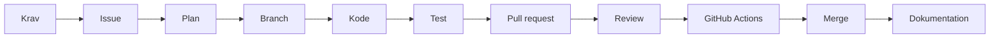

> AI-genereret kode er først færdig, når den er forstået, testet, reviewet og koblet til et issue.

Forslag til repo-navne:

```text
copilot-workshop-java-taskapp
copilot-workshop-dotnet-taskapp
```

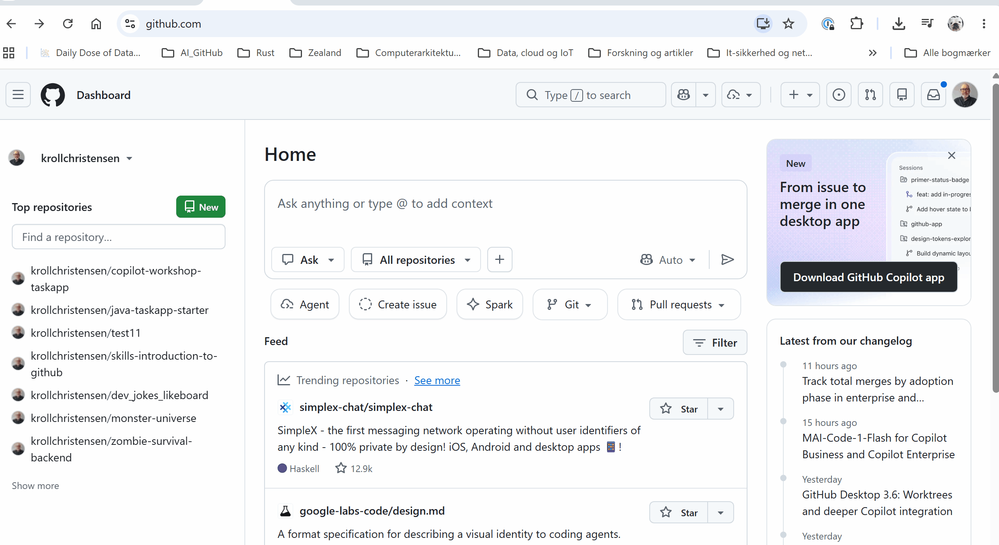

## Case

Vi arbejder med en lille task-app:

1. Oprette en task.
2. Se alle tasks.
3. Markere en task som færdig.
4. Se antal åbne tasks.

Casen er lille, fordi fokus er arbejdsformen:

```text
issue -> plan -> branch -> kode -> test -> pull request -> review -> actions -> agent
```

## Sæt jer på tværs

Sæt jer gerne sammen på tværs af fagretninger.

| Rolle | Ser især på |
|---|---|
| Systemudvikling | Issues, user stories, acceptkriterier, board og sporbarhed |
| Programmering | Kode, struktur, test, debugging og forklaring |
| Teknologi | Git, build, GitHub Actions, runtime, sikkerhed og drift |
| IT- og forretning | Værdi, prioritering, scope og projektstyring |

## Workshopplan

Forslag til 2,5-3 timer:

| Tid | Aktivitet |
|---:|---|
| 00:00-00:15 | Intro, case og grupper |
| 00:15-00:40 | Opret lokalt projekt og kør startkode |
| 00:40-00:55 | Git, første commit, GitHub-repo og push |
| 00:55-01:10 | Find issues og workflows i workshoprepoet |
| 01:10-01:25 | Project board, labels og issue #1 |
| 01:25-01:40 | Copilot Plan uden kode |
| 01:40-02:10 | Branch og implementering af issue #1 |
| 02:10-02:30 | Test, commit, push og pull request |
| 02:30-02:45 | Review og GitHub Actions |
| 02:45-02:55 | Agent på issue #3 |
| 02:55-03:00 | Fælles opsamling |

Hvis tiden er kort, bruges issue #2 og issue #3 som demo eller hjemmeopgave.

## Copilot-arbejdsformer

| Arbejdsform | Bruges til | Pointe |
|---|---|---|
| Ask | Forklare kode, fejl, Git og test | Forståelse |
| Plan | Lave implementeringsplan uden kode | Krav og afgrænsning |
| Agent | Løse en tydelig og afgrænset opgave | Kræver review |

```text
Ask før forståelse.
Plan før implementering.
Agent først når opgaven er tydelig og afgrænset.
```

## Starttilstand

Projektet starter som et næsten tomt konsolprogram.

Java:

```java
public class Main {
    public static void main(String[] args) {
        System.out.println("Task app starter");
        System.out.println("Start herfra og implementer issue #1: Opret task");
    }
}
```

C#:

```csharp
Console.WriteLine("Task app starter");
Console.WriteLine("Start herfra og implementer issue #1: Opret task");
```

## Klassediagram for resultatet

Dette er ikke startkoden. Det er den struktur, vi arbejder hen imod gennem issues.

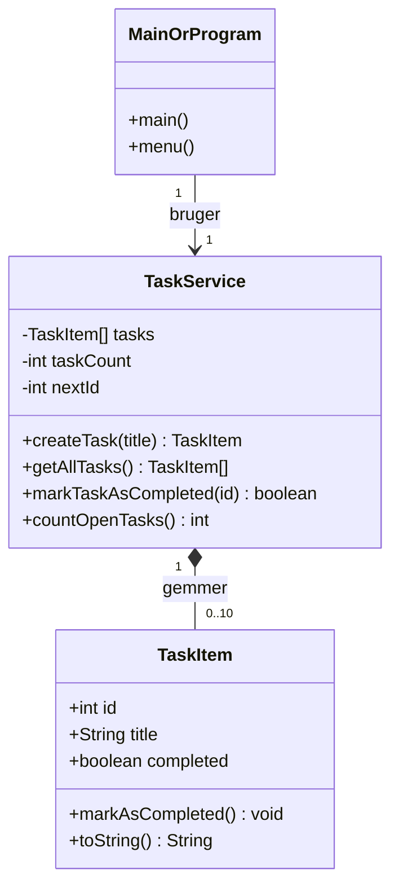
---

# Hands-on del 1: Opret lokalt projekt

## Java i IntelliJ

1. Åbn IntelliJ.
2. Vælg `New Project`.
3. Vælg Java og en installeret JDK.
4. Navngiv projektet `copilot-workshop-java-taskapp`.
5. Opret `Main.java`.
6. Indsæt Java-startkoden fra afsnittet **Starttilstand**.
7. Kør programmet.

## .NET i Rider, Visual Studio eller terminal

```bash
mkdir copilot-workshop-dotnet-taskapp
cd copilot-workshop-dotnet-taskapp
dotnet new console -n TaskApp
```

Erstat indholdet i `Program.cs` med C#-startkoden fra afsnittet **Starttilstand**.

Kør programmet:

```bash
dotnet run --project TaskApp/TaskApp.csproj
```

## Copilot Ask

```text
Forklar kort dette projekt.
Hvad er projektets startpunkt, og hvordan kører jeg det lokalt?
Svar på dansk og på begynderniveau.
```

Tjek:

- Projektet kan køres lokalt.
- Programmet skriver de to startlinjer.
- Gruppen kan forklare, hvor programmet starter.

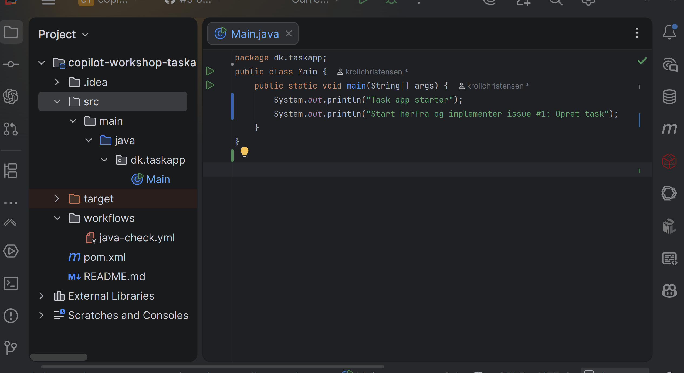

---

# Hands-on del 2: Git og første commit

Kør fra projektets rod.

Java:

```bash
cd copilot-workshop-java-taskapp
git init
git add .
git commit -m "Initial Java task app"
```

.NET:

```bash
cd copilot-workshop-dotnet-taskapp
git init
git add .
git commit -m "Initial dotnet task app"
```

Det kan også gøres i IDE’et: `Enable Version Control Integration`, `Create Git Repository`, `Commit` eller `Git Changes`.

Tjek:

- Git er initialiseret.
- Første commit er lavet.
- Gruppen kan forklare, hvad et commit er.
---

# Hands-on del 3: Opret GitHub-repo og push

1. Gå til GitHub.
2. Klik `New repository`.
3. Brug fx `copilot-workshop-java-taskapp` eller `copilot-workshop-dotnet-taskapp`.
4. Opret repoet uden README, hvis projektet allerede findes lokalt.
5. Kopiér push-kommandoerne fra GitHub.

Typisk:

```bash
git branch -M main
git remote add origin https://github.com/BRUGERNAVN/REPO-NAVN.git
git push -u origin main
```

I IDE kan man ofte bruge:

- IntelliJ/Rider: `Git` -> `GitHub` -> `Share Project on GitHub`
- Visual Studio: `Git` -> `Create Git Repository`
- VS Code: Source Control -> `Publish Branch`

Tjek:

- Projektet er pushet til GitHub.
- Repoet viser `Main.java` eller `Program.cs`.
- Gruppen kan forklare forskellen på lokalt repo og GitHub-repo.

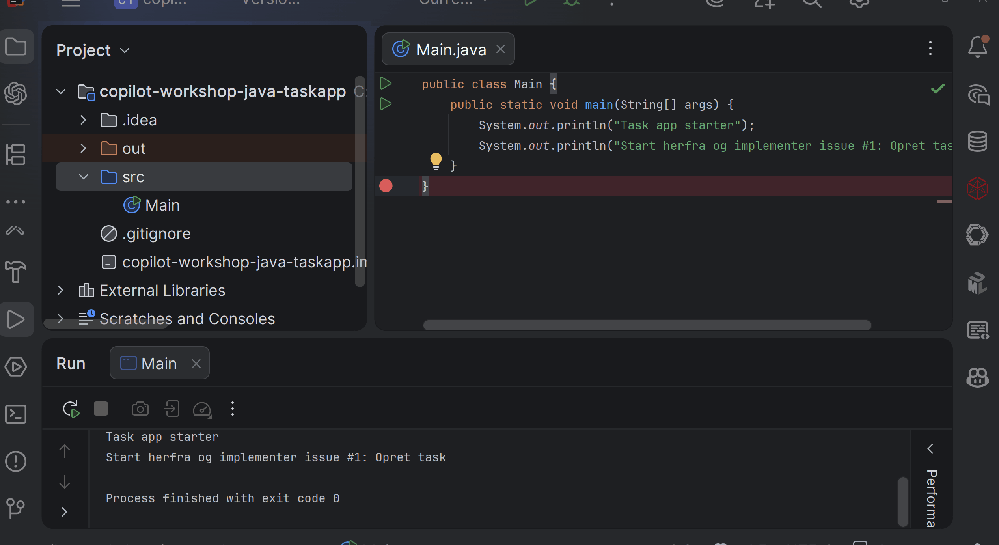

---

# Hands-on del 4: Find issues og workflows i workshoprepoet

I underviserens workshoprepo skal I finde:

```text
README.md
docs/issues
.github/workflows
```

- `README.md` er workshopmanualen.
- `docs/issues` indeholder issue-tekster, som kopieres til egne GitHub-issues.
- `.github/workflows` indeholder workflow-filer, som kopieres til egne repositories, når GitHub Actions afprøves.

Tjek:

- I kan finde `docs/issues`.
- I kan finde `.github/workflows`.
- I forstår, at filer hentes fra workshoprepoet, men arbejdet foregår i eget repo.

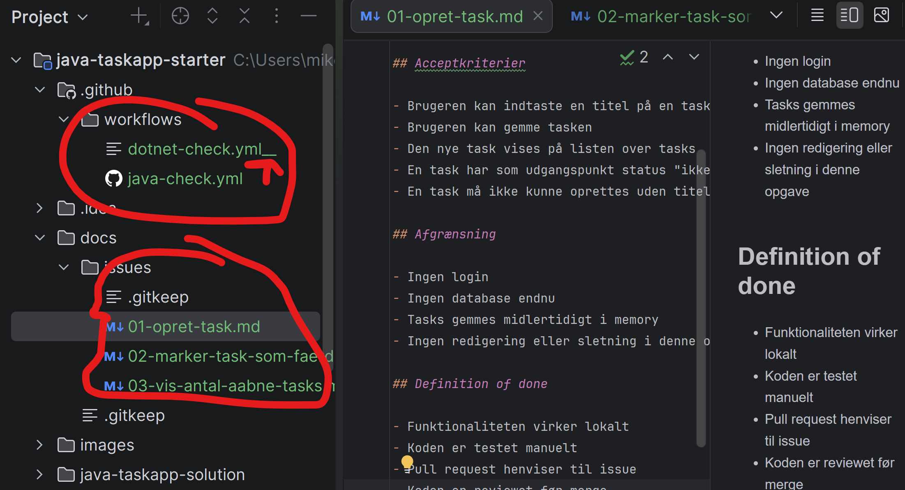

---

# Hands-on del 5: Project board og labels

## Opret Project board

1. Gå til eget GitHub-repo.
2. Klik **Projects**.
3. Klik **New project** eller **Link a project**.
4. Vælg **Board**, eller skift view til **Board**.
5. Navngiv boardet, fx `Task app - gruppe 1`.
6. Ret kolonnerne til:

```text
Backlog
Ready
In progress
Review
Done
```

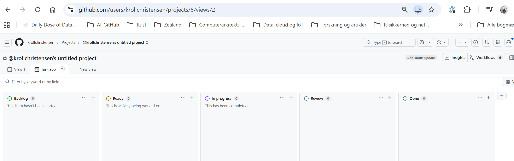

## Opret labels

Labels oprettes på selve repository’et:

1. Gå til **Issues**.
2. Klik **Labels**.
3. Klik **New label**.
4. Opret:

```text
systemudvikling
programmering
teknologi
it-forretning
feature
bug
test
documentation
```

Labels bruges til at sortere, prioritere og forstå issues og pull requests.

| Label | Bruges til |
|---|---|
| systemudvikling | User stories, acceptkriterier, proces og review |
| programmering | Kode, metoder, klasser, fejlretning og test |
| teknologi | Git, GitHub, branches, build og GitHub Actions |
| it-forretning | Værdi, prioritering, scope og brugerbehov |
| feature | Ny funktionalitet |
| bug | Fejl der skal rettes |
| test | Test eller kvalitetssikring |
| documentation | README eller dokumentation |

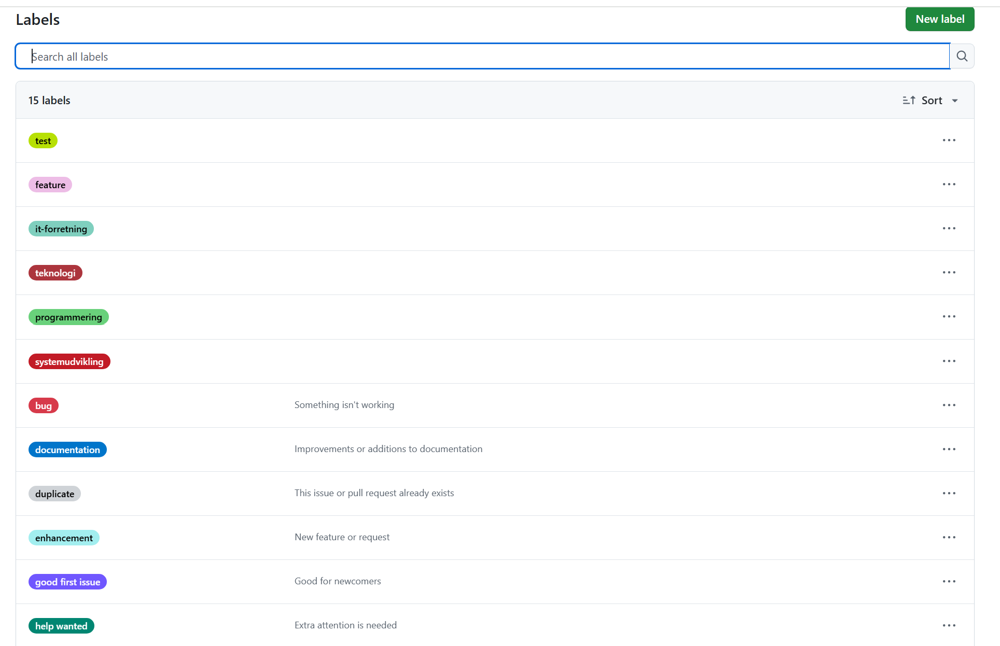

Tjek:

- Boardet har de fem kolonner.
- Labels er oprettet.
- Gruppen kan forklare forskellen på et issue og en pull request.

---

# Hands-on del 6: Issue #1 Opret task

Nu oprettes første issue i eget GitHub-repo.

Issue-teksten hentes fra workshoprepoet:

```text
docs/issues/01-opret-task.md
```

Gør sådan:

1. Gå til eget GitHub-repo.
2. Klik **Issues** -> **New issue**.
3. Titel:

```text
Opret task
```

4. Kopiér hele indholdet fra `docs/issues/01-opret-task.md` ind i issuet.
5. Tilføj labels:

```text
systemudvikling
programmering
feature
test
```

6. Opret issuet.
7. Tilføj issuet til Project boardet i højre side under **Projects**.
8. Sæt status til `Ready`.

Tjek:

- Issue har user story, acceptkriterier, afgrænsning og definition of done.
- Issue har relevante labels.
- Issue er på boardet og står i `Ready`.

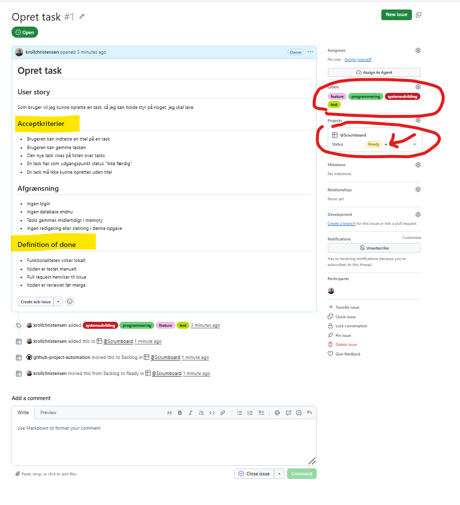

---

# Hands-on del 7: Copilot Plan uden kode

Før der skrives kode, skal Copilot lave en plan.

```text
Plan før kode.
Forståelse før implementering.
Mennesket vurderer, før AI hjælper.
```

Gør sådan:

1. Åbn issue #1 på GitHub.
2. Kopiér issue-teksten.
3. Åbn Copilot Chat i IDE’et.
4. Brug prompten herunder.
5. Læs planen og afvis forslag, der er for avancerede.

Prompt:

```text
Her er GitHub issue #1:

[indsæt issue-teksten]

Lav en kort implementeringsplan, men skriv ikke kode endnu.

Planen skal deles op i:
1. Hvilke filer eller klasser der sandsynligvis skal laves
2. Hvilke tests der bør skrives
3. Hvilke spørgsmål udvikleren bør afklare, før der kodes
4. Hvordan acceptkriterierne kontrolleres

Husk:
- Brug Java eller C# afhængigt af mit projekt
- Hold planen simpel
- Foreslå ikke database
- Foreslå ikke webframework
- Skriv ikke kode
```

Vigtigt:

- Tryk ikke på **Implement Plan** endnu.
- Hvis Copilot opretter `plan.md`, kan den gemmes eller afvises med **Reject**.

Tjek:

- Planen indeholder ikke kode.
- Gruppen kan forklare planen.
- Gruppen kan koble planen til acceptkriterierne.

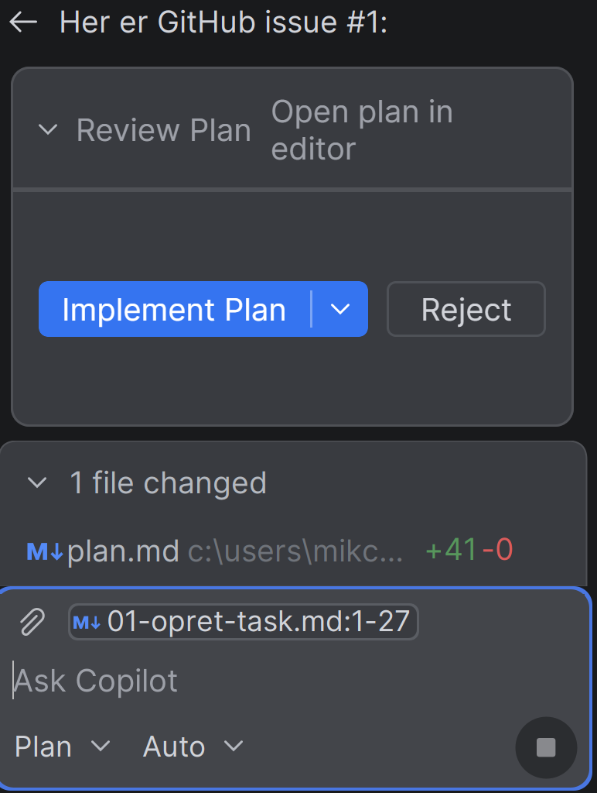

---

# Hands-on del 8: Opret branch

Flyt issue #1 til `In progress`.

Terminal:

```bash
git checkout main
git pull
git checkout -b feature/opret-task
git push -u origin feature/opret-task
```

I IDE/Git UI:

1. Opret branch `feature/opret-task`.
2. Skift til branchen.
3. Push branchen til GitHub.

Tjek:

- Branch hedder `feature/opret-task`.
- Branch findes både lokalt og på GitHub.

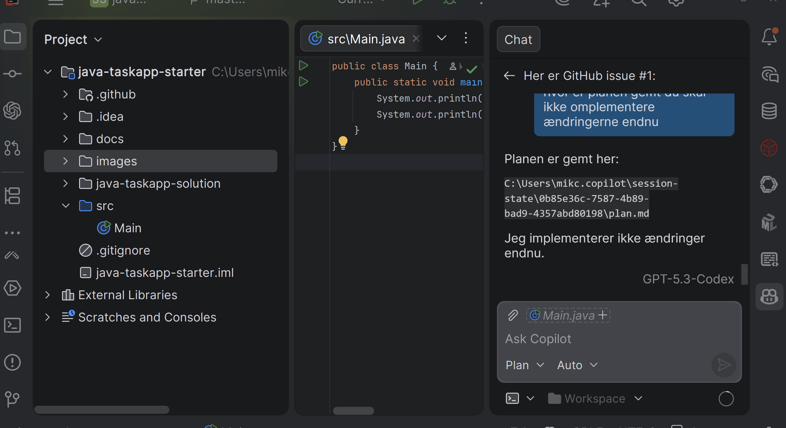

---

# Hands-on del 9: Implementer issue #1 med Agent

Koden skrives i IDE’et. GitHub bruges til issue, board og senere pull request.

Tjek først:

- issue #1 står i `In progress`
- branch er `feature/opret-task`
- projektet kan køre lokalt

Åbn Copilot Chat i IDE’et, vælg **Agent**, og brug prompten for dit spor.

## Java-prompt

```text
Implementer issue #1 i denne Java-konsolapplikation.

Lav en Task-klasse med id, title og completed.
Lav en TaskService, der gemmer tasks i et array med plads til 10 tasks.
En task må ikke oprettes med tom titel.
Udvid Main med en simpel menu: opret task, se alle tasks, afslut.

Hold koden simpel og egnet til begyndere.
Brug ikke ArrayList, database eller Spring Boot.
Efter implementering skal du forklare, hvilke acceptkriterier der er opfyldt.
```

## .NET-prompt

```text
Implementer issue #1 i denne C# .NET-konsolapplikation.

Lav en TaskItem-klasse med Id, Title og Completed.
Lav en TaskService, der gemmer tasks i et array med plads til 10 tasks.
En task må ikke oprettes med tom titel.
Udvid Program.cs med en simpel menu: opret task, se alle tasks, afslut.

Hold koden simpel og egnet til begyndere.
Brug ikke List, database eller ASP.NET.
Efter implementering skal du forklare, hvilke acceptkriterier der er opfyldt.
```

Kodekrav:

```text
Java: Task.java, TaskService.java, Main.java
.NET: TaskItem.cs, TaskService.cs, Program.cs
```

Tjek:

- En task kan oprettes.
- Tom titel afvises.
- Alle tasks kan vises.
- Gruppen kan forklare, hvor data gemmes.

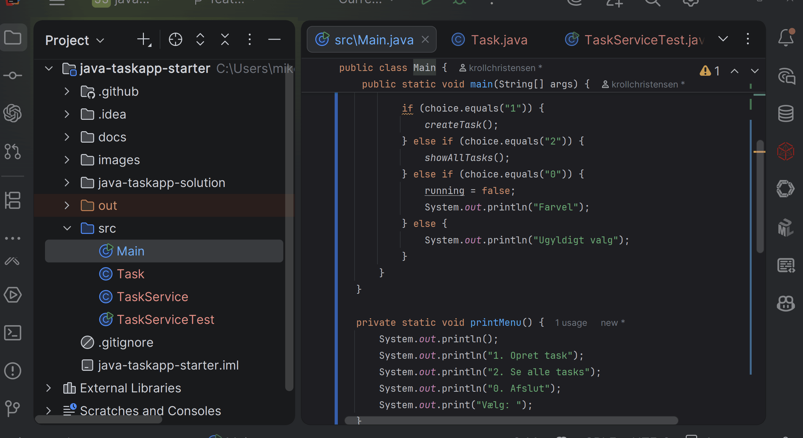

---

# Hands-on del 10: Kør og test

AI-genereret kode skal køres, testes og forstås.

Java:

```bash
javac -d out src/*.java
java -cp out Main
```

.NET:

```bash
dotnet run --project TaskApp/TaskApp.csproj
```

Manuel test:

| Test | Forventet resultat |
|---|---|
| Opret task med titel | Tasken oprettes og vises |
| Opret task med tom titel | Programmet viser fejlbesked |
| Vis alle tasks | Alle oprettede tasks vises |
| Opret flere tasks | Alle tasks får forskellige id’er |
| Opret over max antal | Programmet håndterer det uden crash |

Copilot Ask:

```text
Sammenlign denne kode med acceptkriterierne fra issue #1.

Svar kort:
1. Hvilke acceptkriterier er opfyldt?
2. Hvad bør testes manuelt?
3. Hvilke spørgsmål bør en studerende kunne svare på?
```

Tjek:

- Programmet er kørt.
- Både gyldigt og ugyldigt input er testet.
- Gruppen kan forklare mindst én begrænsning.

---

# Hands-on del 11: Commit, push og pull request

Gem ændringer i Git, send dem til GitHub og opret pull request.

| Begreb | Betydning |
|---|---|
| Commit | Gemmer ændringer lokalt i Git |
| Push | Sender ændringer op til GitHub |
| Pull request | Forslag om at flette ændringer ind i `main` |
| Review | Gennemgang af koden før merge |
| Merge | Fletter ændringerne ind i `main` |

Tjek først:

- branch er `feature/opret-task`
- koden virker lokalt
- issue #1 er testet manuelt

Terminal:

```bash
git status
git add .
git commit -m "Add task creation feature"
git push
```

Hvis Git siger, at branchen ikke har upstream:

```bash
git push -u origin feature/opret-task
```

I IDE/Git UI:

1. Åbn **Commit** eller **Git Changes**.
2. Vælg ændrede filer.
3. Commit-besked:

```text
Add task creation feature
```

4. Klik **Commit**.
5. Klik **Push**.

Opret pull request på GitHub:

1. Gå til **Pull requests**.
2. Klik **New pull request** eller **Compare & pull request**.
3. Vælg:

```text
base: main
compare: feature/opret-task
```

4. Klik **Create pull request**.

Pull request-beskrivelse:

```md
## Hvad er lavet?

Denne pull request implementerer oprettelse af tasks i konsolappen.

## Acceptkriterier

- [ ] Brugeren kan indtaste en titel
- [ ] Brugeren kan gemme tasken
- [ ] Tasken vises på listen
- [ ] Tasken er som standard ikke færdig
- [ ] Tom titel afvises

## Test

Beskriv hvordan funktionen er testet.

Closes #1
```

`Closes #1` lukker issue #1 automatisk, når pull requesten merges.

---

# Hands-on del 12: Review pull request

Review foregår primært på GitHub.

Gør sådan:

1. Åbn pull requesten fra `feature/opret-task` til `main`.
2. Klik **Files changed**.
3. Gennemgå ændrede filer.
4. Brug Copilot som støtte, hvis det er relevant.
5. Skriv mindst én review-kommentar eller lav mundtlig review.
6. Merge først, når koden opfylder acceptkriterierne.

Copilot kan starte review automatisk. Kommentarerne skal stadig vurderes kritisk.

Review-prompt i Copilot Chat:

```text
Review denne pull request som underviser i programmering.

Fokusér på:
1. Om koden opfylder acceptkriterierne
2. Om koden er forståelig for begyndere
3. Om der mangler test
4. Om der er unødvendig kompleksitet
5. Hvilke spørgsmål den studerende bør kunne svare på
```

Tjek:

- `Files changed` er gennemgået.
- Acceptkriterier er vurderet.
- Der er ikke merget ukritisk.

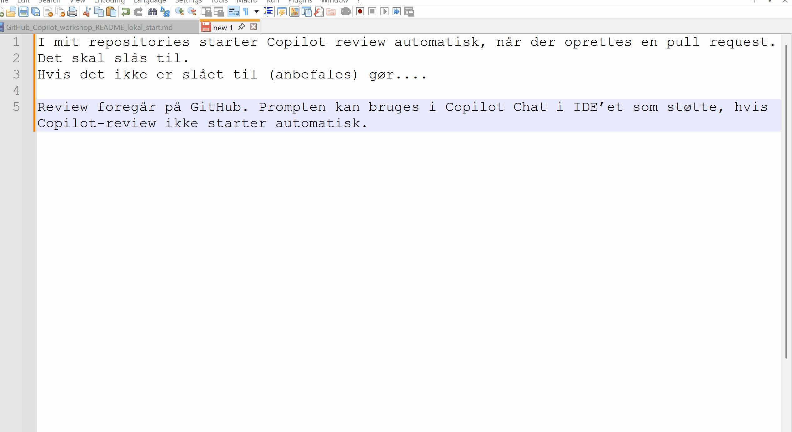

---

# Hands-on del 13: GitHub Actions

GitHub Actions bruges til automatisk teknisk kontrol.

Pointen er, at kode ikke kun skal virke lokalt i IDE’et. Den skal også kunne bygge eller kompilere i et fælles teknisk miljø.

Workflow-filer hentes fra workshoprepoet:

```text
.github/workflows/java-check.yml
.github/workflows/dotnet-check.yml
```

Kopiér den relevante workflow-fil til eget repo.

Gør sådan:

1. Opret `.github/workflows` i eget repo.
2. Kopiér `java-check.yml` eller `dotnet-check.yml` fra workshoprepoet.
3. Commit og push ændringen.
4. Åbn fanen **Actions** i GitHub.
5. Se om workflowet er grønt eller rødt.
6. Åbn loggen, hvis workflowet fejler.

Prompt ved fejl:

```text
Denne GitHub Actions-check fejler.
Her er fejlbeskeden:

[indsæt fejlbeskeden]

Forklar fejlen og foreslå en rettelse.
Skriv ikke ny kode endnu.
```

Tjek:

- Workflow-filen ligger i eget repo.
- Actions-fanen kan findes.
- Gruppen kan forklare, hvad workflowet tester.

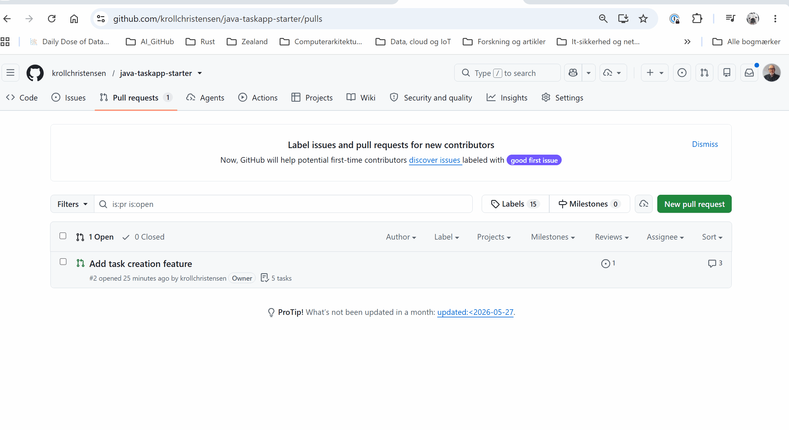

---

# Hands-on del 14: Issue #2 Marker task som færdig

Nu gentages workflowet med en ny funktion.

Issue-teksten hentes fra workshoprepoet:

```text
docs/issues/02-marker-task-som-faerdig.md
```

Gør sådan:

1. Opret issue med titlen `Marker task som færdig`.
2. Kopiér teksten fra `docs/issues/02-marker-task-som-faerdig.md`.
3. Tilføj labels: `systemudvikling`, `programmering`, `feature`, `test`.
4. Tilføj issuet til boardet og flyt det til `Ready`.
5. Brug Copilot Plan uden kode.
6. Opret branch:

```text
feature/marker-task-faerdig
```

7. Implementér funktionen i IDE’et.
8. Kør og test programmet.
9. Commit og push.
10. Opret pull request.
11. Review før merge.

Kort flow:

```text
issue → plan → branch → kode → test → pull request → review
```

Tjek:

- En task kan markeres som færdig.
- Færdig status vises i listen.
- Forkert id håndteres.
- Pull request er reviewet før merge.

---

# Hands-on del 15: Issue #3 Vis antal åbne tasks med Agent

Nu prøves agent-workflowet på en lille, tydelig opgave.

Issue-teksten hentes fra workshoprepoet:

```text
docs/issues/03-vis-antal-aabne-tasks.md
```

Gør sådan:

1. Opret issue med titlen `Vis antal åbne tasks`.
2. Kopiér teksten fra `docs/issues/03-vis-antal-aabne-tasks.md`.
3. Tilføj labels og board-status `Ready`.
4. Opret branch:

```text
feature/vis-antal-aabne-tasks
```

5. Åbn Copilot Chat i IDE’et.
6. Vælg **Agent**.
7. Brug prompten:

```text
Her er issue #3:

[indsæt hele issue-teksten]

Implementer løsningen.
Ændr kun de nødvendige filer.
Behold array-løsningen.
Brug ikke database, webframework eller nye packages.

Efter implementering skal du forklare:
1. Hvilke filer der er ændret
2. Hvilke acceptkriterier der er opfyldt
3. Hvordan løsningen kan testes manuelt
```

Regler:

- Agenten skal have tydelige acceptkriterier.
- Agentens ændringer skal læses, testes og reviewes.
- Mennesker beslutter, om koden må merges.

Tjek:

- Antal åbne tasks vises korrekt.
- Færdige tasks tælles ikke med.
- `0` vises, hvis der ikke er åbne tasks.
- Eksisterende funktionalitet virker stadig.
- Agentens ændringer er gennemgået manuelt.

---

# Hands-on del 16: Fælles opsamling

Diskutér hvor workflowets dele hører hjemme.

| Fagligt blik | Eksempler fra workshoppen |
|---|---|
| Systemudvikling | User stories, acceptkriterier, board, review af krav |
| Programmering | Klasser, metoder, fejlinput, test og kodeforklaring |
| Teknologi | Git, branch, push, Actions, build og teknisk kvalitet |
| IT- og forretning | Værdi, prioritering, scope og ansvar |

## Semesterprogression

| Semester | Fokus |
|---|---|
| 1. semester | Ask, Plan, simple issues, acceptkriterier og kodeforståelse |
| 2. semester | Branches, pull requests, test, review og små agentopgaver |
| 3. semester | Agent-workflows, CI/CD, deployment, sikkerhed og professionel kvalitet |

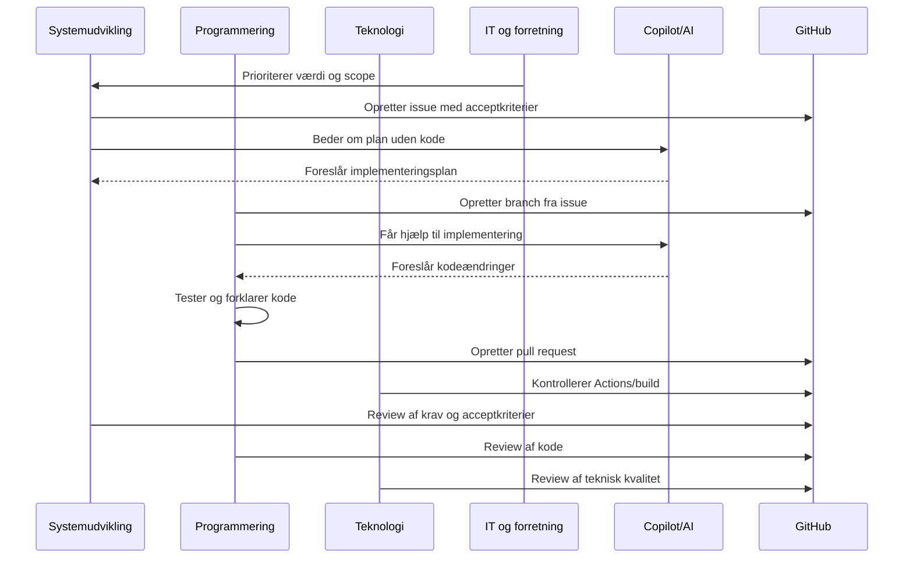

## Afsluttende princip

> AI er en del af udviklingsprocessen, men den faglige vurdering ligger stadig hos mennesket.

AI kan foreslå, forklare, planlægge og implementere. Mennesker skal forstå, teste, reviewe og tage ansvar.
